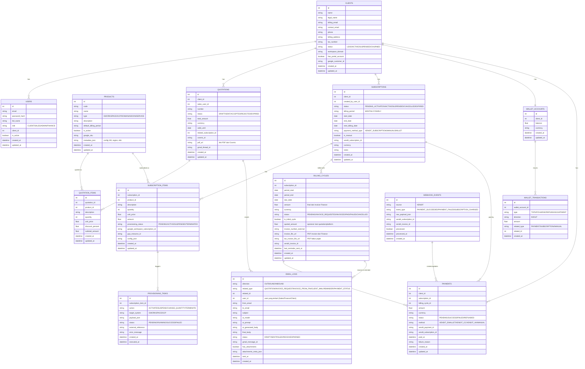

```mermaid
erDiagram
    CLIENTS {
        int id
        string name
        string legal_name
        string billing_email
        string contact_email
        string phone
        string billing_address
        string tax_number
        string status              "LEAD/ACTIVE/SUSPENDED/CHURNED"
        string workspace_domain
        boolean has_portal_account
        string google_customer_id
        datetime created_at
        datetime updated_at
    }

    USERS {
        int id
        string email
        string password_hash
        string full_name
        string role                "CLIENT/SALES/ADMIN/FINANCE"
        int client_id
        boolean is_active
        datetime created_at
        datetime updated_at
    }

    PRODUCTS {
        int id
        string code
        string name
        string type                "GWORKSPACE/GCP/DOMAIN/ADDON/SERVICE"
        string description
        string default_billing_period
        boolean is_active
        string google_sku
        string metadata_json       "config VM, region, dsb"
        datetime created_at
        datetime updated_at
    }

    QUOTATIONS {
        int id
        int client_id
        int sales_user_id
        string number
        string status              "DRAFT/SENT/ACCEPTED/REJECTED/EXPIRED"
        float total_amount
        string currency
        date valid_until
        int related_subscription_id
        string cosmic_id
        string pdf_url             "link PDF dari Cosmic"
        string gmail_thread_id
        datetime created_at
        datetime updated_at
    }

    QUOTATION_ITEMS {
        int id
        int quotation_id
        int product_id
        string description
        int quantity
        float unit_price
        float discount_percent
        float subtotal_amount
        datetime created_at
        datetime updated_at
    }

    SUBSCRIPTIONS {
        int id
        int client_id
        int created_by_user_id
        string status              "PENDING_ACTIVATION/ACTIVE/SUSPENDED/CANCELLED/EXPIRED"
        string billing_period      "MONTHLY/YEARLY"
        date start_date
        date end_date
        date next_billing_date
        string payment_method_type "XENDIT_SUBSCRIPTION/MANUAL/WALLET"
        boolean is_manual
        string xendit_subscription_id
        string currency
        string notes
        datetime created_at
        datetime updated_at
    }

    SUBSCRIPTION_ITEMS {
        int id
        int subscription_id
        int product_id
        string description
        int quantity
        float unit_price
        float amount
        string provisioning_status "PENDING/ACTIVE/SUSPENDED/TERMINATED"
        string google_workspace_subscription_id
        string gcp_resource_id
        string config_json
        datetime created_at
        datetime updated_at
    }

    BILLING_CYCLES {
        int id
        int subscription_id
        date period_start
        date period_end
        date due_date
        float amount               "final dari invoice Finance"
        string currency
        string status              "PENDING/INVOICE_REQUESTED/INVOICED/PAID/FAILED/CANCELLED"
        boolean is_initial_cycle
        float quoted_amount        "opsional: dari quotation/platform"
        string invoice_number_external
        string invoice_file_url    "PDF invoice dari Finance"
        string tax_invoice_file_url "PDF faktur pajak"
        string xendit_invoice_id
        datetime last_reminder_sent_at
        datetime created_at
        datetime updated_at
    }

    PAYMENTS {
        int id
        int client_id
        int subscription_id
        int billing_cycle_id
        float amount
        string currency
        string status              "PENDING/SUCCESS/FAILED/REFUNDED"
        string method              "XENDIT_EWALLET/XENDIT_CC/XENDIT_VA/MANUAL"
        string xendit_payment_id
        string xendit_subscription_id
        datetime paid_at
        string failure_reason
        datetime created_at
        datetime updated_at
    }

    WALLET_ACCOUNTS {
        int id
        int client_id
        float balance
        string currency
        datetime created_at
        datetime updated_at
    }

    WALLET_TRANSACTIONS {
        int id
        int wallet_account_id
        string type                "TOPUP/CHARGE/REFUND/ADJUSTMENT"
        string direction           "IN/OUT"
        float amount
        string related_type        "PAYMENT/SUBSCRIPTION/MANUAL"
        int related_id
        datetime created_at
    }

    EMAIL_LOGS {
        int id
        string direction           "OUTBOUND/INBOUND"
        string related_type        "QUOTATION/INVOICE_REQUEST/INVOICE_FROM_FIN/CLIENT_MAIL/REMINDER/PAYMENT_STATUS"
        int related_id
        int user_id                "user yang terkait (Sales/Finance/Client)"
        string from_email
        string to_email
        string subject
        string ai_model
        string ai_prompt
        string ai_generated_body
        string final_body
        string status              "DRAFT/SENT/FAILED/RECEIVED/PARSED"
        string gmail_message_id
        boolean has_attachments
        string attachments_meta_json
        datetime sent_at
        datetime created_at
    }

    PROVISIONING_TASKS {
        int id
        int subscription_item_id
        string action              "ACTIVATE/SUSPEND/CHANGE_QUANTITY/TERMINATE"
        string target_system       "GWORKSPACE/GCP"
        string payload_json
        string status              "PENDING/RUNNING/SUCCESS/FAILED"
        string external_reference
        string error_message
        datetime created_at
        datetime executed_at
    }

    WEBHOOK_EVENTS {
        int id
        string source              "XENDIT"
        string event_type          "PAYMENT_SUCCEEDED/PAYMENT_FAILED/SUBSCRIPTION_CHARGED"
        string raw_payload_json
        string xendit_subscription_id
        string xendit_invoice_id
        boolean processed
        datetime processed_at
        datetime created_at
    }

    CLIENTS ||--o{ USERS : "has"
    CLIENTS ||--o{ QUOTATIONS : "has"
    CLIENTS ||--o{ SUBSCRIPTIONS : "has"
    CLIENTS ||--|| WALLET_ACCOUNTS : "has"
    CLIENTS ||--o{ PAYMENTS : "has"

    QUOTATIONS ||--o{ QUOTATION_ITEMS : "has"
    QUOTATIONS ||--o{ EMAIL_LOGS : "emails"

    PRODUCTS ||--o{ QUOTATION_ITEMS : "quoted as"
    PRODUCTS ||--o{ SUBSCRIPTION_ITEMS : "subscribed as"

    SUBSCRIPTIONS ||--o{ SUBSCRIPTION_ITEMS : "has"
    SUBSCRIPTIONS ||--o{ BILLING_CYCLES : "billed with"
    SUBSCRIPTIONS ||--o{ PAYMENTS : "paid by"

    BILLING_CYCLES ||--o{ PAYMENTS : "allocated to"
    BILLING_CYCLES ||--o{ EMAIL_LOGS : "invoice & reminder"

    WALLET_ACCOUNTS ||--o{ WALLET_TRANSACTIONS : "moves"

    SUBSCRIPTION_ITEMS ||--o{ PROVISIONING_TASKS : "triggers"

    WEBHOOK_EVENTS ||--o{ PAYMENTS : "creates/updates"
```
