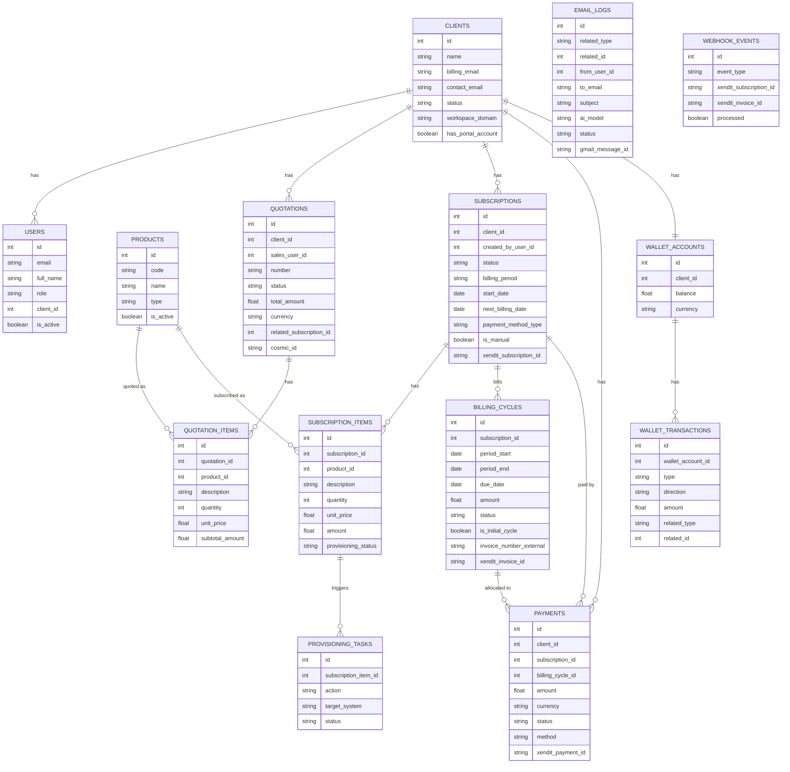

```mermaid
erDiagram
    USERS {
        int id
        string email
        string full_name
        string role
        int client_id
        boolean is_active
    }

    CLIENTS {
        int id
        string name
        string billing_email
        string contact_email
        string status
        string workspace_domain
        boolean has_portal_account
    }

    PRODUCTS {
        int id
        string code
        string name
        string type
        boolean is_active
    }

    QUOTATIONS {
        int id
        int client_id
        int sales_user_id
        string number
        string status
        float total_amount
        string currency
        int related_subscription_id
        string cosmic_id
    }

    QUOTATION_ITEMS {
        int id
        int quotation_id
        int product_id
        string description
        int quantity
        float unit_price
        float subtotal_amount
    }

    SUBSCRIPTIONS {
        int id
        int client_id
        int created_by_user_id
        string status
        string billing_period
        date start_date
        date next_billing_date
        string payment_method_type
        boolean is_manual
        string xendit_subscription_id
    }

    SUBSCRIPTION_ITEMS {
        int id
        int subscription_id
        int product_id
        string description
        int quantity
        float unit_price
        float amount
        string provisioning_status
    }

    BILLING_CYCLES {
        int id
        int subscription_id
        date period_start
        date period_end
        date due_date
        float amount
        string status
        boolean is_initial_cycle
        string invoice_number_external
        string xendit_invoice_id
    }

    PAYMENTS {
        int id
        int client_id
        int subscription_id
        int billing_cycle_id
        float amount
        string currency
        string status
        string method
        string xendit_payment_id
    }

    WALLET_ACCOUNTS {
        int id
        int client_id
        float balance
        string currency
    }

    WALLET_TRANSACTIONS {
        int id
        int wallet_account_id
        string type
        string direction
        float amount
        string related_type
        int related_id
    }

    EMAIL_LOGS {
        int id
        string related_type
        int related_id
        int from_user_id
        string to_email
        string subject
        string ai_model
        string status
        string gmail_message_id
    }

    PROVISIONING_TASKS {
        int id
        int subscription_item_id
        string action
        string target_system
        string status
    }

    WEBHOOK_EVENTS {
        int id
        string event_type
        string xendit_subscription_id
        string xendit_invoice_id
        boolean processed
    }

    CLIENTS ||--o{ USERS : "has"
    CLIENTS ||--o{ QUOTATIONS : "has"
    CLIENTS ||--o{ SUBSCRIPTIONS : "has"
    CLIENTS ||--o{ PAYMENTS : "has"
    CLIENTS ||--|| WALLET_ACCOUNTS : "has"

    QUOTATIONS ||--o{ QUOTATION_ITEMS : "has"
    PRODUCTS ||--o{ QUOTATION_ITEMS : "quoted as"

    SUBSCRIPTIONS ||--o{ SUBSCRIPTION_ITEMS : "has"
    PRODUCTS ||--o{ SUBSCRIPTION_ITEMS : "subscribed as"
    SUBSCRIPTIONS ||--o{ BILLING_CYCLES : "bills"
    SUBSCRIPTIONS ||--o{ PAYMENTS : "paid by"

    BILLING_CYCLES ||--o{ PAYMENTS : "allocated to"

    WALLET_ACCOUNTS ||--o{ WALLET_TRANSACTIONS : "has"

    SUBSCRIPTION_ITEMS ||--o{ PROVISIONING_TASKS : "triggers"
```
    BILLING_CYCLES ||--o{ EMAIL_LOGS : "invoice request / reminder"
    QUOTATIONS ||--o{ EMAIL_LOGS : "quotation emails"
