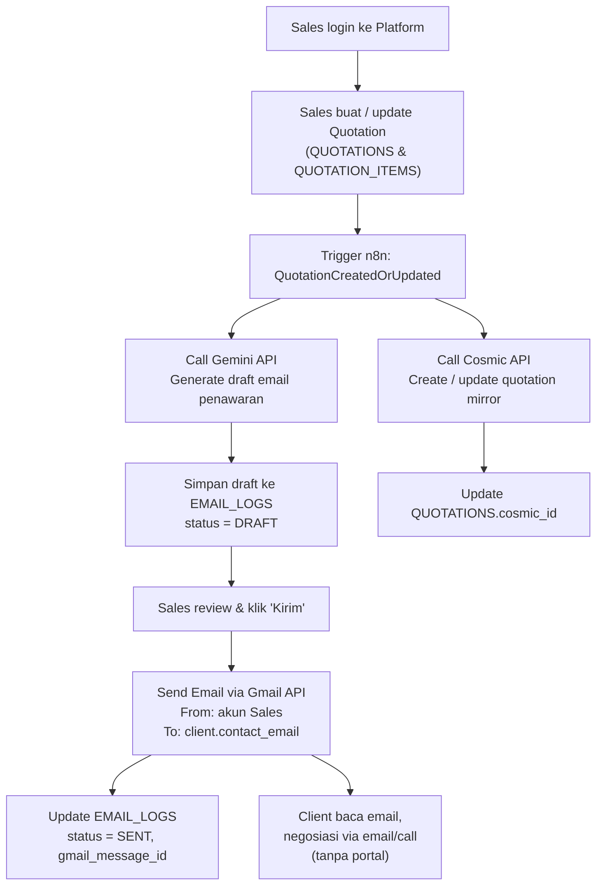
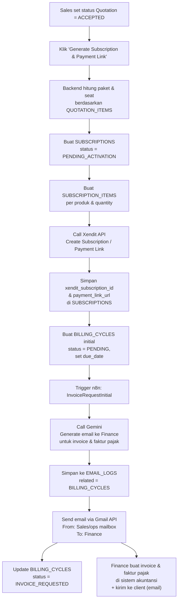
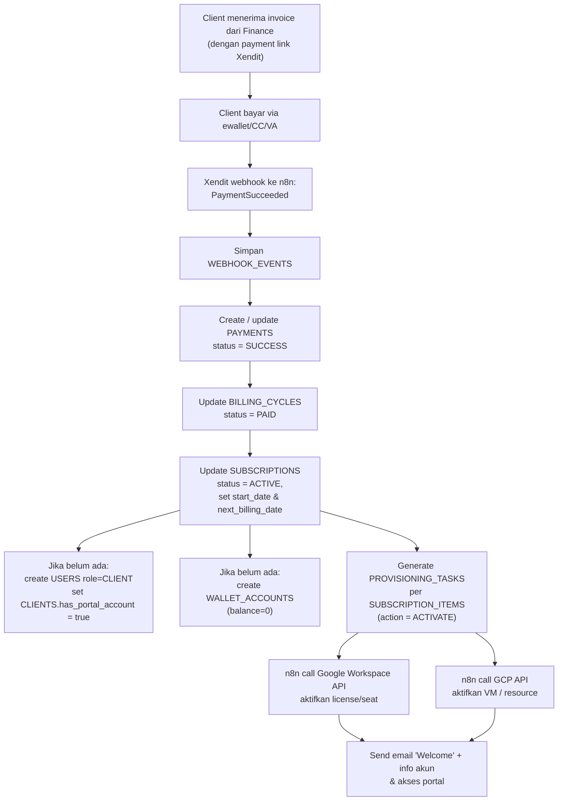
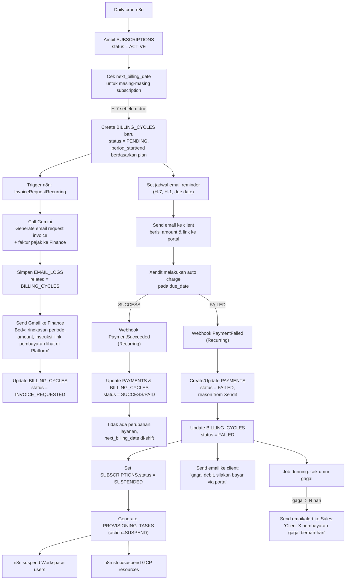
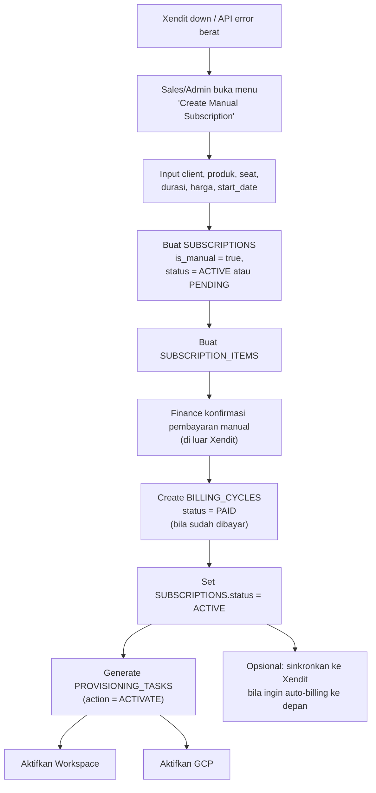

# ERD dan Workflow Otomasi Operasional Cloud

## 1. Aktivitas Utama

* Pengelolaan **lead/client** dan subscription (Google Workspace & GCP).
* Pembuatan dan pengiriman **quotation** oleh **Sales** (terhubung ke Gmail, Gemini, dan Cosmic).
* Pembuatan **request invoice & faktur pajak** ke tim Finance (email otomatis).
* Pengelolaan **pembayaran berlangganan** via **Xendit subscription** (ewallet, credit card, VA).
* Otomasi **aktivasi/penonaktifan** Google Workspace dan GCP berdasarkan status subscription.
* Penyediaan **BI & laporan penjualan** (Finance & manajemen) tanpa Finance harus mengelola invoice di platform.

---

## 2. User Platform

* **Sales**

  * Membuat & mengupdate quotation di platform.
  * Mengirim email penawaran ke client (via Gmail, body digenerate LLM/Gemini).
  * Menandai *deal* dan memicu pembuatan subscription + payment link Xendit.
  * Mendapat notifikasi jika pembayaran recurring gagal berhari-hari (untuk follow-up manual).

* **Client**

  * **Sebelum bayar pertama**: belum punya akun; komunikasi via email dengan Sales.
  * **Setelah bayar pertama sukses**:

    * Punya akun portal (role `CLIENT`).
    * Melihat subscription aktif, tagihan, histori pembayaran, kemungkinan deposit/wallet.
    * Mengakses link pembayaran ulang (bila perlu).

* **Admin**

  * Input & update data master (produk, setting harga, konfigurasi basis subscription).
  * Bisa membuat/mengedit subscription secara manual jika Xendit down.
  * Bisa override status subscription (aktif/nonaktif) secara manual.

* **Finance**

  * Hampir tidak mengoperasikan platform untuk proses harian.
  * Menerima **email otomatis** request pembuatan invoice & faktur pajak.
  * Login ke platform hanya untuk **BI & reporting** (lihat sales, MRR, churn, dsb).

---

## 3. Alur Tingkat Tinggi

1. Sales membuat quotation di platform → email ke client (Gmail, body digenerate Gemini) → quotation dicatat juga di Cosmic.
2. Client dan Sales berkorespondensi di luar portal sampai terjadi *deal*.
3. Sales menandai *deal* → platform membuat **subscription** + **initial billing cycle** dan memanggil **Xendit** untuk membuat subscription/payment link.
4. Platform mengirim **email ke Finance** (pakai Gemini) berisi:

   * Data client untuk invoice & faktur pajak.
   * Ringkasan subscription & nominal.
   * Payment link Xendit untuk dimasukkan ke invoice.
5. Finance membuat **invoice & faktur pajak** di sistem mereka dan mengirim ke client.
6. Client bayar via Xendit → callback ke platform:

   * Subscription jadi **ACTIVE**, `next_billing_date` di-set.
   * Dibuat **akun portal client**, **wallet/deposit account**, dan **provisioning** Google Workspace/GCP.
7. H-7 sebelum jatuh tempo:

   * Sistem otomatis bikin **billing cycle** baru, hitung tagihan.
   * Kirim **email request invoice** ke Finance (pakai Gemini), isi “link pembayaran lihat di Platform [nama]”.
8. Xendit menarik pembayaran recurring:

   * **Sukses** → billing cycle ditandai PAID, tidak ada gangguan layanan.
   * **Gagal** → subscription jadi **SUSPENDED** sampai pembayaran berhasil.
   * Jika gagal berhari-hari → notifikasi ke Sales untuk follow-up.
9. Jika Xendit down, Sales/Admin bisa membuat & mengelola subscription manual di platform.

---

## 4. ERD

```mermaid
erDiagram
    CLIENTS {
        int id
        string name
        string legal_name
        string billing_email
        string contact_email
        string phone
        string billing_address
        string tax_number
        string status          "LEAD/ACTIVE/SUSPENDED/CHURNED"
        string workspace_domain
        boolean has_portal_account
        string google_customer_id
        datetime created_at
        datetime updated_at
    }

    USERS {
        int id
        string email
        string password_hash
        string full_name
        string role            "CLIENT/SALES/ADMIN/FINANCE"
        int client_id
        boolean is_active
        datetime created_at
        datetime updated_at
    }

    PRODUCTS {
        int id
        string code
        string name
        string type            "GWORKSPACE_LICENSE/GCP_RESOURCE/SERVICE"
        string description
        string default_billing_period
        boolean is_active
        string google_sku
        string metadata_json
        datetime created_at
        datetime updated_at
    }

    QUOTATIONS {
        int id
        int client_id
        int sales_user_id
        string number
        string status          "DRAFT/SENT/ACCEPTED/REJECTED/EXPIRED"
        float total_amount
        string currency
        date valid_until
        int related_subscription_id
        string cosmic_id
        string gmail_thread_id
        datetime created_at
        datetime updated_at
    }

    QUOTATION_ITEMS {
        int id
        int quotation_id
        int product_id
        string description
        int quantity
        float unit_price
        float discount_percent
        float subtotal_amount
        datetime created_at
        datetime updated_at
    }

    SUBSCRIPTIONS {
        int id
        int client_id
        int created_by_user_id
        string status              "PENDING_ACTIVATION/ACTIVE/SUSPENDED/CANCELLED/EXPIRED"
        string billing_period      "MONTHLY/YEARLY"
        date start_date
        date end_date
        date next_billing_date
        string payment_method_type "XENDIT_SUBSCRIPTION/MANUAL/WALLET"
        boolean is_manual
        string xendit_subscription_id
        string currency
        string notes
        datetime created_at
        datetime updated_at
    }

    SUBSCRIPTION_ITEMS {
        int id
        int subscription_id
        int product_id
        string description
        int quantity
        float unit_price
        float amount
        string provisioning_status "PENDING/ACTIVE/SUSPENDED/TERMINATED"
        string google_workspace_subscription_id
        string gcp_resource_id
        string config_json
        datetime created_at
        datetime updated_at
    }

    BILLING_CYCLES {
        int id
        int subscription_id
        date period_start
        date period_end
        date due_date
        float amount
        string currency
        string status             "PENDING/INVOICE_REQUESTED/INVOICED/PAID/FAILED/CANCELLED"
        boolean is_initial_cycle
        string invoice_number_external
        string invoice_file_url
        string xendit_invoice_id
        datetime last_reminder_sent_at
        datetime created_at
        datetime updated_at
    }

    PAYMENTS {
        int id
        int client_id
        int subscription_id
        int billing_cycle_id
        float amount
        string currency
        string status           "PENDING/SUCCESS/FAILED/REFUNDED"
        string method           "XENDIT_EWALLET/XENDIT_CC/XENDIT_VA/MANUAL"
        string xendit_payment_id
        string xendit_subscription_id
        datetime paid_at
        string failure_reason
        datetime created_at
        datetime updated_at
    }

    WALLET_ACCOUNTS {
        int id
        int client_id
        float balance
        string currency
        datetime created_at
        datetime updated_at
    }

    WALLET_TRANSACTIONS {
        int id
        int wallet_account_id
        string type             "TOPUP/CHARGE/REFUND/ADJUSTMENT"
        string direction        "IN/OUT"
        float amount
        string related_type     "PAYMENT/SUBSCRIPTION/MANUAL"
        int related_id
        datetime created_at
    }

    EMAIL_LOGS {
        int id
        string related_type     "QUOTATION/INVOICE_REQUEST/REMINDER/PAYMENT_STATUS"
        int related_id
        int from_user_id
        string to_email
        string subject
        string ai_model
        string ai_prompt
        string ai_generated_body
        string final_body
        string status           "DRAFT/SENT/FAILED"
        string gmail_message_id
        datetime sent_at
        datetime created_at
    }

    PROVISIONING_TASKS {
        int id
        int subscription_item_id
        string action           "ACTIVATE/SUSPEND/CHANGE_QUANTITY/TERMINATE"
        string target_system    "GWORKSPACE/GCP"
        string payload_json
        string status           "PENDING/RUNNING/SUCCESS/FAILED"
        string external_reference
        string error_message
        datetime created_at
        datetime executed_at
    }

    WEBHOOK_EVENTS {
        int id
        string source           "XENDIT"
        string event_type       "PAYMENT_SUCCEEDED/PAYMENT_FAILED/SUBSCRIPTION_CHARGED"
        string raw_payload_json
        string xendit_subscription_id
        string xendit_invoice_id
        boolean processed
        datetime processed_at
        datetime created_at
    }

    CLIENTS ||--o{ USERS : "has"
    CLIENTS ||--o{ QUOTATIONS : "has"
    CLIENTS ||--o{ SUBSCRIPTIONS : "has"
    CLIENTS ||--|| WALLET_ACCOUNTS : "has"
    CLIENTS ||--o{ PAYMENTS : "has"

    QUOTATIONS ||--o{ QUOTATION_ITEMS : "has"
    QUOTATIONS ||--o{ EMAIL_LOGS : "emails"

    PRODUCTS ||--o{ QUOTATION_ITEMS : "quoted as"
    PRODUCTS ||--o{ SUBSCRIPTION_ITEMS : "subscribed as"

    SUBSCRIPTIONS ||--o{ SUBSCRIPTION_ITEMS : "has"
    SUBSCRIPTIONS ||--o{ BILLING_CYCLES : "billed with"
    SUBSCRIPTIONS ||--o{ PAYMENTS : "paid by"

    BILLING_CYCLES ||--o{ PAYMENTS : "allocated to"
    BILLING_CYCLES ||--o{ EMAIL_LOGS : "invoice & reminder"

    WALLET_ACCOUNTS ||--o{ WALLET_TRANSACTIONS : "moves"

    SUBSCRIPTION_ITEMS ||--o{ PROVISIONING_TASKS : "triggers"

    WEBHOOK_EVENTS ||--o{ PAYMENTS : "creates/updates"
```

---

## 5. Penjelasan Entitas

* **Client & User**

  * `CLIENTS` menyimpan profil perusahaan (termasuk LEAD yang belum punya akun).
  * `USERS` menyimpan akun login; role `SALES`, `ADMIN`, `FINANCE`, `CLIENT`.
  * Client hanya punya user portal setelah pembayaran pertama sukses → `has_portal_account = true`.

* **Produk & Subscription**

  * `PRODUCTS` = Google Workspace, GCP, layanan lain.
  * `SUBSCRIPTIONS` = kontrak langganan level perusahaan.
  * `SUBSCRIPTION_ITEMS` = detail seat & resource (contoh: 39 seat Business Standard, 2 VM GCP).

* **Quotation**

  * Dibuat oleh `USERS.role=SALES`.
  * `QUOTATIONS` + `QUOTATION_ITEMS` menyimpan penawaran resmi.
  * Terkait dengan `Cosmic` via `cosmic_id`, dan email via `EMAIL_LOGS`.

* **Billing & Payment**

  * `BILLING_CYCLES` menyimpan setiap periode penagihan (initial & recurring).
  * `PAYMENTS` menyimpan event pembayaran dari Xendit/Manual.
  * `WEBHOOK_EVENTS` menyimpan payload mentah callback Xendit.

* **Deposit / Wallet**

  * `WALLET_ACCOUNTS` & `WALLET_TRANSACTIONS` sebagai akun deposit/wallet client.
  * Dibuat otomatis saat pembayaran pertama sukses.

* **Email & Provisioning**

  * `EMAIL_LOGS` menyimpan seluruh email otomatis (quotation, invoice request, reminder, payment status), termasuk prompt & respon LLM.
  * `PROVISIONING_TASKS` menyimpan perintah ke Google Workspace/GCP (activate/suspend/dll) yang dijalankan n8n.

---

## 6. Workflow Diagram

### 6.1 Workflow: Quotation oleh Sales + Email Client + Cosmic

---

### 6.2 Workflow: Deal → Generate Subscription & Invoice Request ke Finance

---

### 6.3 Workflow: Payment Sukses → Akun Client + Subscription + Deposit + Provisioning

---

### 6.4 Workflow: Recurring Billing, Reminder, Suspend, Notifikasi

---

### 6.5 Workflow: Manual Subscription jika Xendit Down

