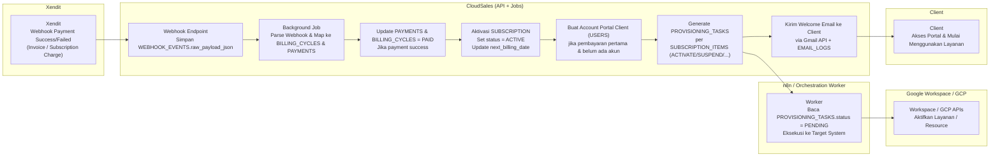

# CloudSales – Workflows

Dokumen ini menggambarkan workflow utama CloudSales sesuai FSD, disesuaikan dengan arsitektur:

- Backend FastAPI di **GCP Cloud Run**
- Database di **Cloud SQL (PostgreSQL)**
- Background Jobs via **Cloud Run Jobs / Cloud Scheduler + Pub/Sub**
- Integrasi:
  - **Cosmic** untuk quotation & PDF
  - **Xendit** untuk pembayaran & subscription
  - **Gmail API** untuk email outbound/inbound
  - **LLM (mis. Gemini)** untuk draft & parsing email
  - **Google Workspace / GCP** untuk provisioning layanan
  - **n8n / Orchestration** untuk eksekusi provisioning tasks

## 1. High-Level Architecture

```mermaid
flowchart LR
    subgraph Clients
        C1["Client Browser<br>Portal Client"]
    end

    subgraph Internal["Internal Users"]
        S1["Sales / Admin / Finance<br>Internal Portal"]
    end

    subgraph CloudSales["CloudSales Platform<br>(GCP)"]
        API["FastAPI Backend (Cloud Run)<br>Subscription & Billing API"]
        DB["Cloud SQL PostgreSQL<br>(Subscriptions, Billing, Payments)"]
        JOBS["Background Jobs (Cloud Run Jobs / Scheduler)<br>Recurring Billing, Dunning, Webhook Processing"]
    end

    subgraph Integrations["External Services"]
        COSMIC["Cosmic<br>Quotation & PDF"]
        XENDIT["Xendit<br>Payment & Subscription"]
        GMAIL["Gmail API<br>Email Outbound/Inbound"]
        LLM["LLM / Gemini<br>Email Draft & Parsing"]
        GWORK["Google Workspace / GCP<br>Provisioning APIs"]
        ORCH["n8n / Orchestration<br>Execute Provisioning Tasks"]
    end

    C1 --> API
    S1 --> API

    API --> DB
    JOBS --> DB
    API --> JOBS

    API --> COSMIC
    API --> XENDIT
    API --> GMAIL
    API --> LLM
    API --> ORCH
    ORCH --> GWORK

    XENDIT --> API
    XENDIT --> JOBS
````

## 2. Flow: Quotation → Invoice Request → Payment Pertama

```mermaid
flowchart LR
    subgraph Sales
        S1["Sales<br>Buat Quotation di CloudSales (Portal Internal)"]
        S2["Sales<br>Kirim Quotation ke Client (via Email)"]
        S3["Sales<br>Trigger Request Invoice ke Finance"]
    end

    subgraph CloudSales["CloudSales (API + DB)"]
        CS1["Simpan QUOTATION & QUOTATION_ITEMS<br>di PostgreSQL"]
        CS2["Sync ke Cosmic<br>Buat Document & PDF Quotation"]
        CS3["Kirim Email Quotation ke Client<br>via Gmail API + EMAIL_LOGS"]
        CS4["Kirim Email Request Invoice ke Finance<br>(LLM Draft + Gmail API)"]
        CS5["Terima Upload Invoice & Faktur dari Finance<br>Update BILLING_CYCLES (invoice_file_url, tax_invoice_file_url)"]
        CS6["Buat BILLING_CYCLES Initial<br>Generate Payment Link Xendit / Invoice Xendit"]
        CS7["Kirim Email Invoice + Payment Link ke Client<br>via Gmail API + EMAIL_LOGS"]
    end

    subgraph Finance
        F1["Finance<br>Buat Invoice & Faktur di Sistem Keuangan"]
        F2["Finance<br>Upload Invoice & Faktur ke CloudSales<br>(attach ke BILLING_CYCLES)"]
    end

    subgraph Client
        CL1["Client<br>Menerima Quotation (PDF / Link)"]
        CL2["Client<br>Menerima Invoice + Link Bayar"]
        CL3["Client<br>Bayar via Link Xendit"]
    end

    subgraph Xendit
        X1["Xendit<br>Proses Pembayaran Pertama"]
        X2["Xendit<br>Kirim Webhook Payment (Success/Failed)<br>ke CloudSales Webhook Endpoint"]
    end

    S1 --> CS1 --> CS2 --> CS3 --> S2 --> CL1
    CL1 --> S3
    S3 --> CS4 --> F1 --> F2 --> CS5 --> CS6 --> CS7 --> CL2 --> CL3
    CL3 --> X1 --> X2 --> CS6
```

### Penjelasan Singkat Flow 2.1

1. **Sales** membuat quotation melalui portal internal:

   * Backend FastAPI menyimpan ke `QUOTATIONS` dan `QUOTATION_ITEMS`.
2. **CloudSales** melakukan sync ke Cosmic:

   * Mengirim detail quotation, menerima `cosmic_id` + `pdf_url`.
3. Sistem mengirim email quotation ke client:

   * Body email bisa di-draft LLM (opsional), dikirim via Gmail API.
   * Disimpan di `EMAIL_LOGS` dengan `related_type = QUOTATION`.
4. Sales minta Finance membuat invoice:

   * Email request otomatis dibuat (template/LLM) dan dikirim ke Finance.
5. Finance generate invoice & faktur di sistem keuangan:

   * File PDF di-upload ke CloudSales → di-link ke `BILLING_CYCLES`.
6. CloudSales membuat **initial BILLING_CYCLES**:

   * Menyimpan `quoted_amount`, `amount`, due date, dsb.
   * Meminta Xendit membuat invoice/payment link (`xendit_invoice_id`).
7. CloudSales mengirim email invoice ke client:

   * Email berisi invoice + link bayar Xendit.
8. Client klik link dan bayar di Xendit:

   * Xendit memproses & akan kirim webhook ke CloudSales (flow berikutnya).


## 3. Flow: Payment Success → Aktivasi Subscription & Provisioning



### Penjelasan Singkat Flow 3.1

1. **Xendit** mengirim webhook untuk payment:

   * Endpoint CloudSales menerima request dan menyimpan raw payload ke `WEBHOOK_EVENTS`.
2. **Background Job** (Cloud Run Job / Scheduler / Pub/Sub):

   * Membaca `WEBHOOK_EVENTS` yang `processed = false`.
   * Menentukan jenis event (`PAYMENT_SUCCEEDED`, `PAYMENT_FAILED`, `SUBSCRIPTION_CHARGED`).
   * Membuat/memutakhirkan record di `PAYMENTS`.
   * Mengupdate `BILLING_CYCLES.status` (misalnya `PAID`).
3. Jika **pembayaran pertama sukses**:

   * `SUBSCRIPTIONS.status` diubah menjadi `ACTIVE`.
   * `next_billing_date` diisi sesuai `billing_period`.
   * Jika client belum punya akun portal, dibuatkan `USERS` dengan `role = CLIENT`.
4. Untuk setiap `SUBSCRIPTION_ITEMS`:

   * Dibuat `PROVISIONING_TASKS` dengan `action` sesuai (aktivasi, suspend, dsb).
5. Worker orkestrasi (mis. n8n):

   * Membaca `PROVISIONING_TASKS` dengan status `PENDING`.
   * Memanggil API Google Workspace / GCP:

     * Membuat lisensi, project, VM, dsb.
   * Mengupdate status menjadi `RUNNING` → `SUCCESS` atau `FAILED`.
6. Setelah provisioning sukses:

   * CloudSales mengirim **welcome email** ke client:

     * Info login portal
     * Info layanan yang aktif
   * Client dapat mengakses portal dan mulai menggunakan layanan.


## 4. Keterkaitan Workflow & Data Model

* Flow **Quotation → Invoice Request → Payment Pertama** terutama menyentuh:

  * `CLIENTS`, `USERS`, `PRODUCTS`
  * `QUOTATIONS`, `QUOTATION_ITEMS`
  * `BILLING_CYCLES`, `EMAIL_LOGS`
  * Integrasi: Cosmic, Gmail, Xendit
* Flow **Payment Success → Aktivasi Subscription & Provisioning** menyentuh:

  * `WEBHOOK_EVENTS`, `PAYMENTS`, `BILLING_CYCLES`
  * `SUBSCRIPTIONS`, `SUBSCRIPTION_ITEMS`
  * `PROVISIONING_TASKS`, `EMAIL_LOGS`
  * Integrasi: Xendit, n8n, Google Workspace/GCP
